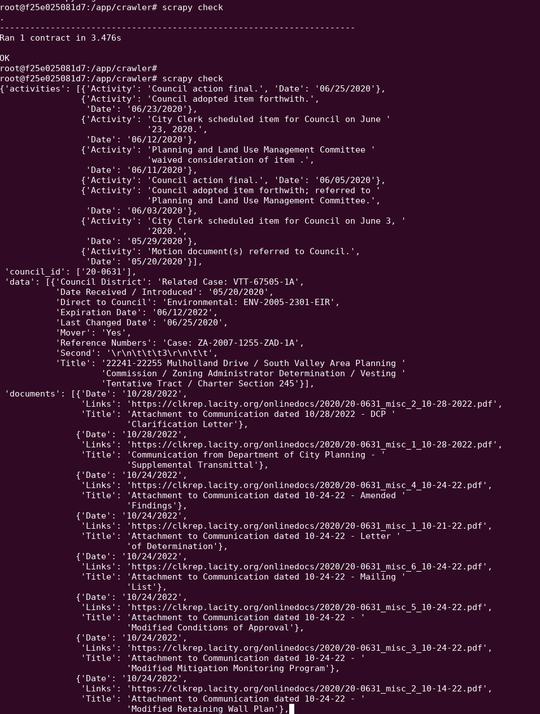

## This is a submition for the test project of ATC_Research

## Problems:

Given an url from LACityClerk Connect, parse this informations from it:

1. File ID
2. Description
3. Documents (URL to PDF file)
4. Vote info
5. File activity list
6. File history (if existed)

Example URL: https://cityclerk.lacity.org/lacityclerkconnect/index.cfm?fa=ccfi.viewrecord&cfnumber=21-1247

## How to do it

Using Django for database modeling and convinient admin site, Scrapy for data crawling, Postgres for Database, and Dockerize everything :D

## Up and running

To deploy the Django web app, first run

`docker compose up --build -d`

Create superuser:

`docker compose run --rm django ./manage.py createsuperuser`

Run crawler check (Using scrapy contract)

`docker compose run --rm django cd crawler/crawler && scrapy check`

Sample crawled data

